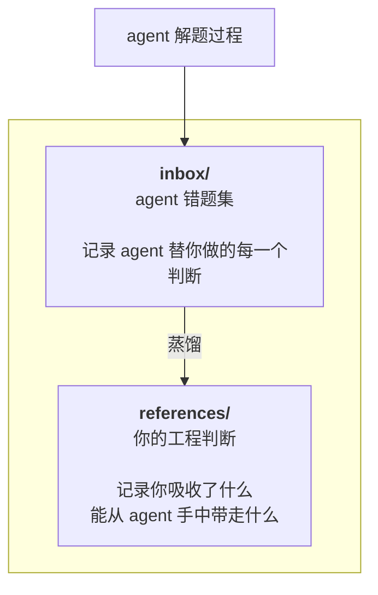
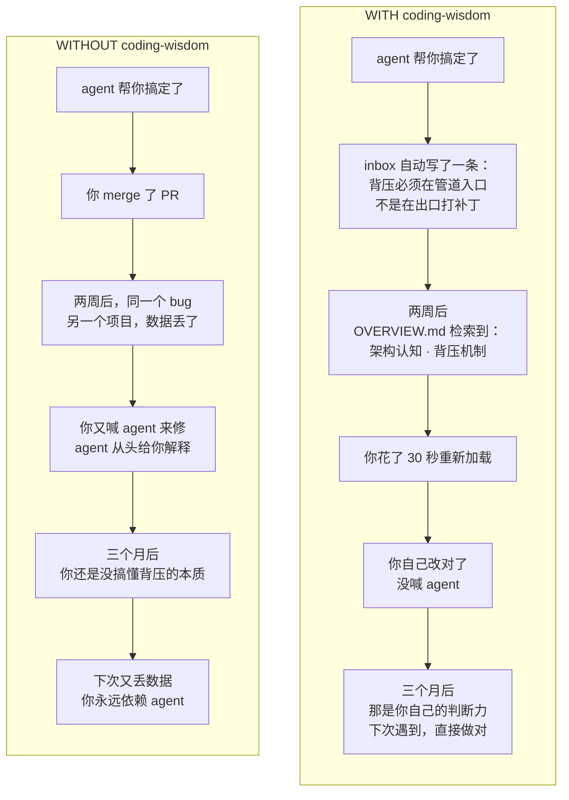
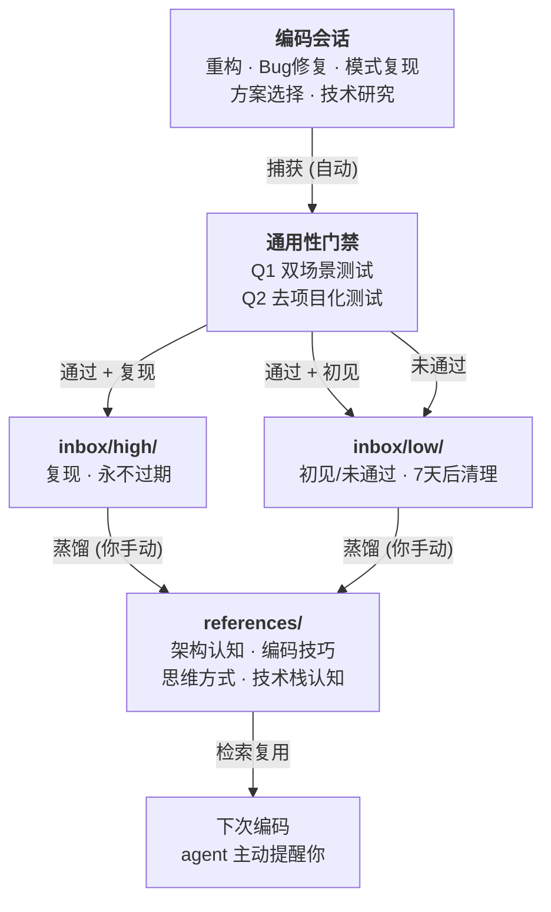

# Coding Wisdom

<p align="center">
  
</p>

> **agent 错题集 + 你的能力增强剂。**

---

## 你正在经历这个

周一。你用 agent 啃一个 Kafka 消费端背压问题。
你从来没写过消息队列。agent 帮你写了，代码跑通了。

周三。另一个项目，消费又慢了。你打开代码，盯着消费者配置。
上周的代码是你看着 agent 写的，但那些决策——
为什么信号量挡在入口、auto-commit 为什么是敌人——你没记住。
agent 替你做了判断，你没把判断变成自己的。

> **agent 把答案给了你，但判断过程没给。**

**AI 是能力倍增器，但它的支点是你自己的基线。**
基线不涨，乘出来的结果永远锁死在那个支点上。

---

<p align="center">
  
</p>

---

**coding-wisdom 做的事情很简单：**

① agent 替你跨过去的那个门槛——它自动记下来
② 你有空时，15 分钟蒸馏成**属于你的判断力**
③ 下次再遇到，你不靠 agent 也能做出正确决策

---

## 它是什么

<div align="center">



</div>

**是 agent 错题集**：agent 帮你解决了 Kafka rebalance、JWT 续期、分库分表——那些你第一次接触就被推着往前走的时刻，不记下来就永远没了。

**是你的增强剂**：每周打开 `OVERVIEW.md`，看一眼知识版图。那个数字不是 agent 有多强——**是你吸取了多少判断力。**

---

## 用之前 vs 用之后

一个 Kafka 背压问题。时间线相同，结果不同。

<div align="center">



</div>

---

## 怎么工作

<div align="center">



</div>

---

## 安装

> **Agent 安装指引** — 把下面这行发给任意 AI 编码助手（Claude Code、Codex CLI 等），让它自己读协议、自己装，无需人工操作：
>
> ```
> 请按照 https://github.com/Clannad47/coding-wisdom/blob/main/AGENT_INSTALL.md 安装 coding-wisdom
> ```

### 方式一：Claude Code 插件市场（推荐）

```
/plugin marketplace add Clannad47/coding-wisdom
/plugin install coding-wisdom@coding-wisdom
```

### 方式二：npm

```bash
# 安装
npm install -g coding-wisdom       # 全局安装，自动部署，一步到位
npx coding-wisdom                  # 或一键免安装

# 更新
npm update -g coding-wisdom        # postinstall 自动重新部署
npx coding-wisdom@latest           # npx 方式

# 卸载
coding-wisdom --uninstall          # 删除 skill，清空 inbox/references
npm uninstall -g coding-wisdom     # 移除 npm 包
```

### 方式三：手动安装

```bash
# macOS / Linux
cp -r coding-wisdom ~/.claude/skills/

# Windows
xcopy /E /I coding-wisdom %USERPROFILE%\.claude\skills\coding-wisdom
```

重启 Claude Code，安装完成。

### Codex CLI

```bash
npm install -g coding-wisdom              # install.js 自动检测并部署到 ~/.codex/skills/
```

或通过 Codex 技能安装器：

```
$skill-installer Clannad47/coding-wisdom
```

---

## 平台兼容

同时支持 Claude Code 和 Codex CLI（Agent Skills 开放标准）。差异仅在配置文件命名：

| 概念 | Claude Code | Codex CLI |
|------|------------|-----------|
| 项目上下文 | `CLAUDE.md` | `AGENTS.md` |
| 跨会话记忆 | `MEMORY.md` | `.codex/memories/` |
| Skill 路径 | `~/.claude/skills/` | `~/.codex/skills/` |

---

## 托管到 GitHub（可选）

1. **Fork** 本仓库到你的 GitHub（建议私有，保障数据安全）
2. **Clone** 你的 fork 到 `~/.claude/skills/coding-wisdom`
3. 想追踪 `references/`？删掉 `.gitignore` 里对应的两行忽略规则
4. 正常编码。agent 写 `inbox/`（本地，永不追踪），你蒸馏到 `references/`
5. `git commit && git push` —— 每一次判断力增长都有版本记录
6. 更新：`git pull` 即可获得最新 skill 逻辑，用户数据不受影响

---

## 快速开始

### 1. 正常编码

你做你的事。agent 检测到认知裂缝时自动写入 `inbox/`。

### 2. agent 自动捕获

| 触发事件 | 例子 |
|---|---|
| 结构性重构 | 改核心数据结构、拆分模块 |
| 非平凡 Bug 修复 | 逻辑错误、设计缺陷 |
| 跨项目模式复现 | 不同项目里出现相似设计模式 |
| 方案选择 | A vs B 选了 A，放弃 B 有理由 |
| 技术研究 | 深入研究得出非文档直接结论 |

> tier 由通用性门禁决定：通过 Q1/Q2 + 复现 → `high`，初见或未通过 → `low`（7 天后清理）

零摩擦——你不需要说"记下来"，它自己发生了。

### 3. 蒸馏（每周 15 分钟）

打开 `inbox/high/`。挑 2-3 条你觉得最有价值的。补充 `## 泛化`——从"这个项目的具体 bug"抽象到"任何系统遇到这个信号时应该检查什么"。更新 `_index.md`，跑 `bash scripts/sync-overview.sh`。

### 4. 循环复用

下次编码，agent 自动检索 `references/`。当前场景和你蒸馏过的旧知识相关——它提醒你，你调用的是**你自己的判断**，不是 agent 的。

---

## 一条知识长什么样

核心结构：**我以为 → 其实是**。记录的是认知裂缝——你之前理解错了什么，现在理解对了。

```markdown
# TypedDict 是声明式契约，不是类型标注

## 我以为
TypedDict 只是给 dict 加类型提示的工具。

## 其实是
TypedDict 让数据结构成为自文档化的契约——
每个处理步骤声明自己需要什么、产出什么。

## 背景
Insurance Atom Trigger，Pipeline 重构。多步骤数据流需要跨步骤类型一致性。

## 泛化
凡多步骤数据流，入口契约不应散落在自然语言和 if/else 里。
```

---

## 目录结构

```
coding-wisdom/
├── SKILL.md                     # agent 指令：捕获规则、噪音过滤、动态加载
├── OVERVIEW.md                  # 自动生成，你的知识版图全貌（禁止手动编辑）
├── guides/                      # 按需加载的深层流程
│   ├── distillation.md          #   蒸馏工作流和质量门
│   ├── generalization.md        #   泛化四层模型（现象→模式→原则→可操作规则）
│   ├── web-calibration.md       #   联网校准策略
│   └── ascii-diagrams.md        #   ASCII 架构图规范
├── templates/                   # 条目模板
│   ├── capture-entry.md         #   捕获模板（30 秒写完）
│   └── distilled-entry.md       #   蒸馏后的完整形态
├── scripts/
│   ├── sync-overview.sh         #   从 _index.md 自动生成 OVERVIEW.md (bash)
│   ├── sync-overview.ps1        #   同上（PowerShell）
│   └── setup-local-worktree.*   #   开发者本地隔离脚本
├── inbox/                       # 本地个人数据（不受版本控制）
│   ├── high/                    #   永不过期
│   └── low/                     #   7 天后可清理
└── references/                  # 你的个人知识库
    ├── architecture/            #   架构认知
    │   ├── _index.md
    │   ├── data-flow/           #     数据流与契约设计
    │   └── system-design/       #     系统设计模式
    ├── coding/                  #   编码技巧
    │   └── _index.md
    ├── mindset/                 #   思维方式
    │   └── _index.md
    └── techstack/               #   技术栈深度认知
        └── _index.md
```

`_index.md` 是单一事实源。`OVERVIEW.md` 由脚本自动聚合——蒸馏完跑一次 `bash scripts/sync-overview.sh`，完事。

---

## 知识的四个维度

| 维度 | 你在这里积累什么 |
|---|---|
| `architecture/` | 系统设计、模块边界、数据流、并发模式 |
| `coding/` | 语言惯用法、反模式、数据结构选择 |
| `mindset/` | 好品味、设计哲学、消除特殊情况的直觉 |
| `techstack/` | Kafka rebalance、JWT 生命周期、分库分表实战 |

---

## 设计原则

1. **吸取判断力，不是记 API** — 一条知识应该记录"我被纠正了什么"，不是"我第一次见到了什么"
2. **30 秒捕获 > 完美格式** — 能 30 秒写完的才是可持续的
3. **变少 > 变多** — 90 天未更新的条目标记陈旧，合并或删除
4. **文件名即索引** — 看到 `2026-04-30_fix_backpressure-boundary.md` 就知道内容

---

## FAQ

**Q: 它和 CLAUDE.md / MEMORY.md 有什么区别？**

- `CLAUDE.md`：项目级架构约束
- `MEMORY.md`：跨会话上下文（你是谁、偏好什么）
- `coding-wisdom`：**跨项目的个人工程判断增长引擎** — 跟着你走，不跟项目走

**Q: inbox 会堆满噪音吗？**

触发器只命中 5 种认知裂缝事件。high tier 不过期，low tier 7 天自动消失。

**Q: 能不能自动蒸馏？**

蒸馏是从"项目具体细节"到"任何系统都适用的原则"——这步需要你的判断力介入。agent 可以帮你补泛化和联网校准，但最终是你决定什么值得保留。

---

## 参与贡献

**一个人对"好判断力"的定义永远是窄的。** 你的使用习惯、蒸馏角度、发现的边界情况——都能让这个 skill 变得更好。

几条具体的贡献路径：

```
你的位置                        你可以做什么
────────                        ────────────
用了一段时间，有反馈              → 提 Issue：什么场景捕获太多/太少、什么规则让你烦
发现 bug 或有功能想法              → 提 Issue 或直接开 PR
改了捕获规则/噪音过滤              → PR 到 SKILL.md
写了新的 guide 或改进现有 guide    → PR 到 guides/
改进了模板                        → PR 到 templates/
写了跨平台脚本                     → PR 到 scripts/
翻译 README                       → PR，新文件 README.zh-CN.md 这种格式
```

**Issue 和 PR 都欢迎。** 不确定该走哪条路？先开 Issue 聊聊。

---

## Star History

[](https://star-history.com/#Clannad47/coding-wisdom&Date)

---

## 许可证

MIT
